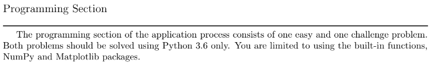

<h2>Description</h2>
This was a major project I did during undergrad. It was the final test to get into one of the distinguished research labs in my college (Physics). Essentially, I was an applicant to that research lab.<br/>
<kbd>

</kbd>
<br/>
<br/>
It was all fine and dandy until I saw we were limited to using NumPy and Matplotlib. They were weaning us from specialized libraries to assess our core programming know-how and problem-solving capabilities... I think.

<h2>Programming Proper</h2>

<p align="center">
Launch the utility: <br/>

<br />
<br />
Select the disk:  <br/>

<br />
<br />
Enter the number of passes: <br/>

<br />
<br />
Confirm your selection:  <br/>

<br />
<br />
Wait for process to complete (may take some time):  <br/>

<br />
<br />
Sanitization complete:  <br/>

<br />
<br />
Observe the wiped disk:  <br/>

</p>

<!--
 ```diff
- text in red
+ text in green
! text in orange
# text in gray
@@ text in purple (and bold)@@
```
--!>
