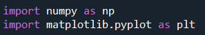

<h2>Description</h2>
This was a major project I did during my undergraduate. It was the final test to get into one of the prominent research labs in my college (Physics). Essentially, I was an applicant and the problem reads as follows: 
<kbd>

</kbd>
 
 
It was all fine and dandy until I saw we were limited to using NumPy and Matplotlib. They were preventing us from using specialized libraries likely to assess our core programming know-how and problem-solving capabilities.

<h2>Programming Proper (WIP)</h2>
The procedure I formulated in my head was as follows. In reverse engineering fashion,

In hindsight, this would have been much easier and efficient if we were taught algorithms for these problems, e.g. depth-first search, breadth-first search, A* search, etc. However, not knowing these things also served as a means for us to set down our own logic or approach, i.e. our own "algorithm".

Starting out with the packages to be used for the entire code:

First is to write a code that uploads the image into the program and convert it into binary. Thankfully, the image was given in black and white so there was no need to recolor or preprocess.

This is definitely a "brute force" way of coding, where I used nested loops to iterate through each pixel in the image. For each pixel, the code checks if the value is 0 (black). If it is, it sets the corresponding element in the maze array to 1 (a wall). Otherwise, it sets it to 0 (a path).

Calling out the maze function, it now looks like this (albeit truncated):

Next is the meat of the problem: solving for the maze. Two things come in mind: I need to write a code that will "walk" through the maze and, prior to that, check its neighboring cells if it's even a walkable path.

Since this is a 2D maze, checking for surrounding paths is also done in 2D (**x**'th row and **y**'th column). And knowing whether or not a path is walkable means

- path is not a wall
- path is within the bounds of the maze
- path has not been visited

Thus the code is written as follows:

