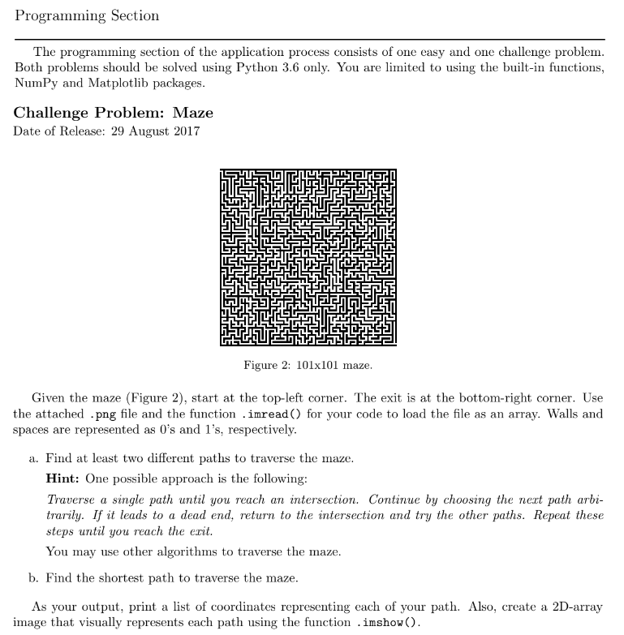

<h2>Description</h2>
This was a major project I did during my undergraduate. It was the final test to get into one of the prominent research labs in my college (Physics). Essentially, I was an applicant and the problem reads as follows: 
<kbd>

</kbd>
 
 
It was all fine and dandy until I saw we were limited to using NumPy and Matplotlib. They were preventing us from using specialized libraries likely to assess our core programming know-how and problem-solving capabilities.

<h2>Programming Proper (WIP)</h2>
The procedure I formulated in my head was as follows. In reverse engineering fashion,

In hindsight, this would have been much easier and efficient if we were taught the algorithms for these problems, e.g. depth-first search, breadth-first search, A* search, etc. However, not knowing these things also served as a medium for us to lay bare our own logic or approach, i.e. our own "algorithm".

Starting with the packages to be used for the entire code:

